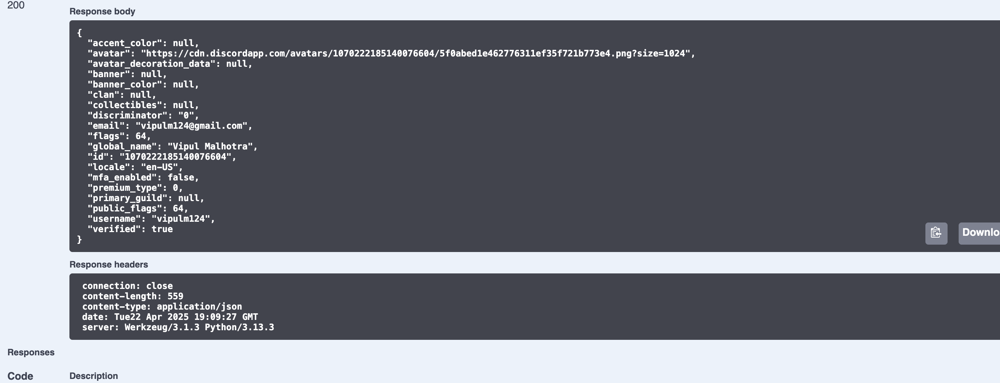

# Discord Login Sample

This repository demonstrates how to implement Discord OAuth2 login in a web application.

## Features
- Discord OAuth2 authentication
- Fetch user profile data

## Prerequisites
- A Discord application set up in the [Discord Developer Portal](https://discord.com/developers/applications)

## Setup

1. Clone the repository:
    ```bash
    git clone https://github.com/your-username/discord-login-sample.git
    cd discord-login-sample
    ```

2. Install dependencies:
    ```bash
    pip install -r requirements.txt
    ```

3. Create a `.env` file in the root directory and add the following:
    ```
    CLIENT_ID=your_discord_client_id
    CLIENT_SECRET=your_discord_client_secret
    DISCORD_REDIRECT_URI=http://127.0.0.1:5000/callback
    AUTHORIZATION_BASE_URL=https://discord.com/api/oauth2/authorize
    TOKEN_URL=https://discord.com/api/v10/oauth2/token
    SCOPE=identify,email
    ```

4. Start the application:
    ```bash
    python3 app.py
    ```

5. Open your browser and navigate to `http://localhost:5000/login`.
    This will redirect to discord login, after doing it, you will get access_token object in below format
    ```
    {
        "access_token": "kdfglkdflgksjdflgksjdlfg",
        "expires_in": 604800,
        "refresh_token": "sdkfglskdjfglksjdlfusgdjhfg",
        "scope": "identify email",
        "token_type": "Bearer"
    }

    ```    


6. You can then go to the swagger document at `http://127.0.0.1:5000/apidocs/` and use the `/getuserinfo/` endpoint to get user information.
   It will required the access_token fetched in previous step as part of the request.

7. Output

Login:


Callback:


Swagger/UserInfo:




## License
This project is licensed under the MIT License. See the [LICENSE](LICENSE) file for details.